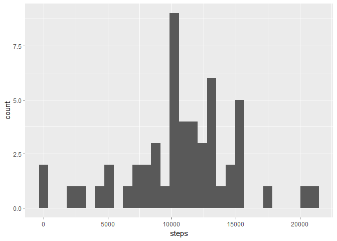
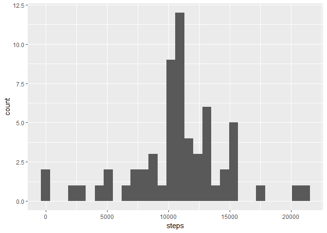

    setwd("/Users/Joshua/Downloads/repdata_data_activity")
    library(dplyr)

    ## Warning: package 'dplyr' was built under R version 3.4.1

    ## 
    ## Attaching package: 'dplyr'

    ## The following objects are masked from 'package:stats':
    ## 
    ##     filter, lag

    ## The following objects are masked from 'package:base':
    ## 
    ##     intersect, setdiff, setequal, union

    library(ggplot2)

    ## Warning: package 'ggplot2' was built under R version 3.4.1

    activity <- read.csv("activity.csv")

    ## R Markdown

    summary(activity)

    ##      steps                date          interval     
    ##  Min.   :  0.00   2012-10-01:  288   Min.   :   0.0  
    ##  1st Qu.:  0.00   2012-10-02:  288   1st Qu.: 588.8  
    ##  Median :  0.00   2012-10-03:  288   Median :1177.5  
    ##  Mean   : 37.38   2012-10-04:  288   Mean   :1177.5  
    ##  3rd Qu.: 12.00   2012-10-05:  288   3rd Qu.:1766.2  
    ##  Max.   :806.00   2012-10-06:  288   Max.   :2355.0  
    ##  NA's   :2304     (Other)   :15840

    str(activity)

    ## 'data.frame':    17568 obs. of  3 variables:
    ##  $ steps   : int  NA NA NA NA NA NA NA NA NA NA ...
    ##  $ date    : Factor w/ 61 levels "2012-10-01","2012-10-02",..: 1 1 1 1 1 1 1 1 1 1 ...
    ##  $ interval: int  0 5 10 15 20 25 30 35 40 45 ...

    head(activity)

    ##   steps       date interval
    ## 1    NA 2012-10-01        0
    ## 2    NA 2012-10-01        5
    ## 3    NA 2012-10-01       10
    ## 4    NA 2012-10-01       15
    ## 5    NA 2012-10-01       20
    ## 6    NA 2012-10-01       25

    steps.complete <- na.omit(activity)
    steps.day <- group_by(steps.complete, date)
    steps.day <- summarize(steps.day, steps=sum(steps))
    summary(steps.day, echo=TRUE)

    ##          date        steps      
    ##  2012-10-02: 1   Min.   :   41  
    ##  2012-10-03: 1   1st Qu.: 8841  
    ##  2012-10-04: 1   Median :10765  
    ##  2012-10-05: 1   Mean   :10766  
    ##  2012-10-06: 1   3rd Qu.:13294  
    ##  2012-10-07: 1   Max.   :21194  
    ##  (Other)   :47

    ## Plot - Histogram of total number of steps taken each day

    qplot(steps, data=steps.day)

    ## `stat_bin()` using `bins = 30`. Pick better value with `binwidth`.

    ## Mean value

    mean(steps.day$steps, echo=TRUE)

    ## [1] 10766.19

    ## Median value

    median(steps.day$steps, echo=TRUE)

    ## [1] 10765

    ## Time series plot of the average number of steps taken

    steps.int <- group_by(steps.complete, interval)
    steps.int <- summarize(steps.int, steps=mean(steps))
    ggplot(steps.int, aes(interval, steps)) + geom_line()

    ## 5-minute interval on average contains maximum number of steps

    steps.int[steps.int$steps==max(steps.int$steps),]

    ## # A tibble: 1 x 2
    ##   interval    steps
    ##      <int>    <dbl>
    ## 1      835 206.1698

    ## Code to describe method for imputing missing value data

    nrow(activity)-nrow(steps.complete)

    ## [1] 2304

    ## Replace missing values by merging mean values for
    ## intervals(steps.int) across all days with the original
    ## data (activity), then create new data set.

    names(steps.int)[2] <- "mean.steps"
    steps.impute <- merge(activity, steps.int)
    steps.impute$steps[is.na(steps.impute$steps)] <- steps.impute$mean.steps[is.na(steps.impute$steps)]

    ## Create histogram of the new data set with 
    ## total steps taken per day.

    steps.day.imp <- group_by(steps.impute, date)
    steps.day.imp <- summarize(steps.day.imp, steps=sum(steps))
    qplot(steps, data=steps.day.imp)

    ## `stat_bin()` using `bins = 30`. Pick better value with `binwidth`.

    ## Mean value of above

    mean(steps.day.imp$steps)

    ## [1] 10766.19

    ## Median value of above

    median(steps.day.imp$steps)

    ## [1] 10766.19

    ## Panel plot describing average steps taken over 5 minute interval
    ## on weekdays vs. weekends

    steps.impute$dayofweek <- weekdays(as.Date(steps.impute$date))
    steps.impute$weekend <-as.factor(steps.impute$dayofweek=="Saturday"|steps.impute$dayofweek=="Sunday")
    levels(steps.impute$weekend) <- c("Weekday", "Weekend")

    ## create data frames for weekdays and weekends

    steps.weekday <- steps.impute[steps.impute$weekend=="Weekday",]
    steps.weekend <- steps.impute[steps.impute$weekend=="Weekend",]

    ## Mean values for time intervals

    steps.int.weekday <- group_by(steps.weekday, interval)
    steps.int.weekday <- summarize(steps.int.weekday, steps=mean(steps))
    steps.int.weekday$weekend <- "Weekday"
    steps.int.weekend <- group_by(steps.weekend, interval)
    steps.int.weekend <- summarize(steps.int.weekend, steps=mean(steps))
    steps.int.weekend$weekend <- "Weekend"

    ## rbind the values and plot results

    steps.int <- rbind(steps.int.weekday, steps.int.weekend)
    steps.int$weekend <- as.factor(steps.int$weekend)
    ggplot(steps.int, aes(interval, steps)) + geom_line() + facet_grid(weekend ~ .)

